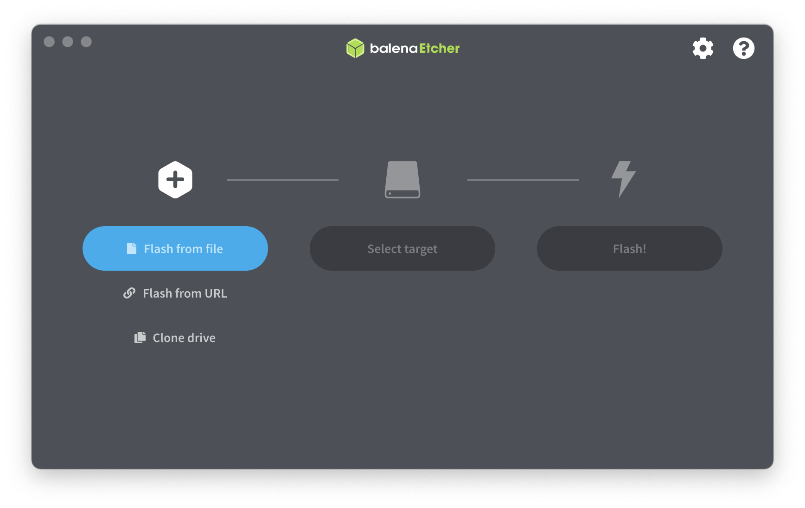
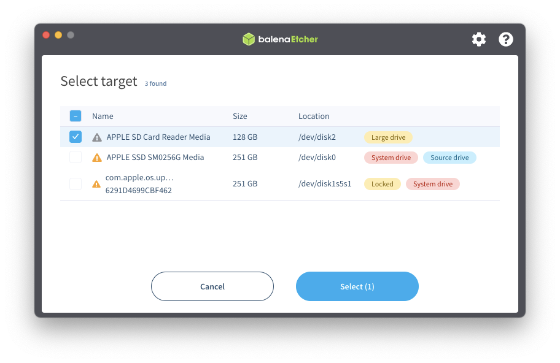
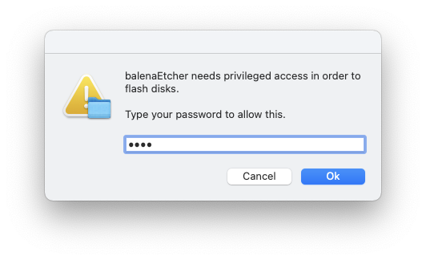
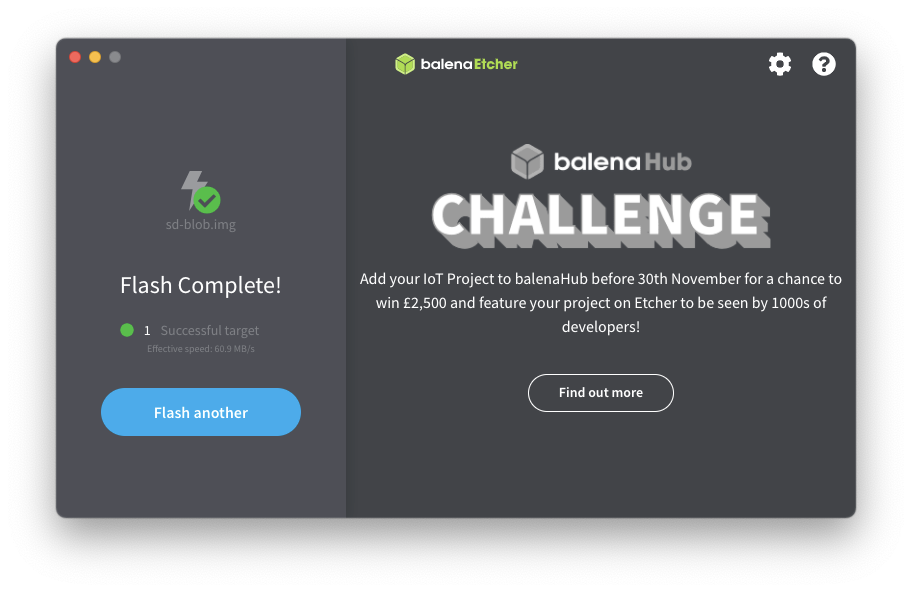

# 初期設定
## Ubuntu を入れる

Jetson Nano Developer Kit SD Card Image をダウンロードする。SDカードを挿さずに、Etcher を起動する（無ければダウンロードしておく）
- https://www.balena.io/etcher/



1. Flash from file → 書き込みたいイメージファイルを選択する（zip形式のままでOK）
2. 書き込み先の選択（用意しておいたSDカードに書き込む）
3. パスワード、実行について確認があるので適宜記入する
4. 10分ほど待つと準備が整う
5. 書き込んだmicroSDカードを Jetson nano に挿して、電源の投入
6. 通常のUbuntuの設定を行えば、Jetson nano のセットアップ完了








## リモートデスクトップの設定


```
sudo apt install openssh-server
```

### mac から

1. Findeの起動
2. Cmd + k （移動／サーバーへ接続）

vino の設定

```
gsettings set org.gnome.Vino require-encryption false    
```

### xfce4のインストール

デスクトップ環境を軽量にするために、xfce環境に変更
```
$ sudo apt install -y xrdp                                             
$ sudo apt install -y xfce4 xfce4-goodies                                      
$ sudo apt install -y tightvncserver                                           
```

なんかうまく行かなかったので、結局リモートデスクトップではなく、ssh -X で　IDEだけを飛ばしてくることにした。


# ssh 接続

mac mini から ssh 接続する際に、イーサネットを抜いて同じWifiに接続すると establishになるが、イーサネットに接続していると ping は通るけれどsshできない問題があった。
まず見えているかを確認する

```
$ arp -a
jetson (192.168.XXX.XXX) at XX:XX:XX:..:46 on en0 ifscope [ethernet]
```

と見えていることがわかる。
またpingも通るが、sshができない。

## 確認したこと

- ping が通るが、SSIDが異なると通信できない
- サブネットマスク（同一のネットワークに属しているかを確認）
  - arp -a で見えているので、同一であることは確か
- 同じデフォルトゲートウェイに接続しているか

## 結論

結論は docomo home5Gの設定の問題であった。
WiFi設定の中に「SSID間通信隔離」という項目がありデフォルトで「有効」になっていた。
そのためこれがVLAN?のような形式で、SSID間を別ネットワークとして扱ってしまっていたのだろう、これを無効にしたとこと問題は解決された。


# Arduino との通信

## CUI からのスケッチの書き込み


### platformio 

```shell
sudo apt install arduino
sudo apt install python3-pip # platformioはpython3.6以上が必要
sudo pip3 install platformio
```

以上で platformio の設定が終わるはずで、platformio のコマンドは無いのだが（なぜ？）、pio という相当するコマンドはインストールされている。

```shell
which pio
/usr/local/bin/pio
```

init を打つと、src, lib, include ディレクトリが自動で生成される。また、platformio.ini ファイルも生成され、 このファイルはプロジェクトの設定ファイルである。

## Jetson と接続する

arduino と USB ケーブルで接続したあとで、lsusb コマンドで接続されているかを確認する。以下の例では正しく認識されていることが分かり、BUS001 Device 004 で認識されている。

```shell
ktakeda@jetson:~$ lsusb
Bus 002 Device 001: ID 1d6b:0003 Linux Foundation 3.0 root hub
Bus 001 Device 004: ID 2341:0043 Arduino SA Uno R3 (CDC ACM)
Bus 001 Device 003: ID 1a40:0801 Terminus Technology Inc. 
Bus 001 Device 002: ID 0bda:8179 Realtek Semiconductor Corp. RTL8188EUS 802.11n Wireless Network Adapter
Bus 001 Device 001: ID 1d6b:0002 Linux Foundation 2.0 root hub
```


```shell
$ dmesg

[ 1035.452056] usb 1-3.2: new full-speed USB device number 4 using tegra-xusb
[ 1035.476182] usb 1-3.2: New USB device found, idVendor=2341, idProduct=0043
[ 1035.476187] usb 1-3.2: New USB device strings: Mfr=1, Product=2, SerialNumber=220
[ 1035.476189] usb 1-3.2: Manufacturer: Arduino (www.arduino.cc)
[ 1035.476192] usb 1-3.2: SerialNumber: 95038303231351800191
[ 1035.507571] cdc_acm 1-3.2:1.0: ttyACM0: USB ACM device
[ 1035.508227] usbcore: registered new interface driver cdc_acm
[ 1035.508231] cdc_acm: USB Abstract Control Model driver for USB modems and ISDN adapters
```

## 初期設定

スケッチなどを作成したいディレクトリに移動して、`pio init --board=uno` を実行する。

```
ktakeda@jetson:~/workspace/led$ pio init --board=uno

The current working directory /home/ktakeda/workspace/led will be used for the project.

The next files/directories have been created in /home/ktakeda/workspace/led
include - Put project header files here
lib - Put here project specific (private) libraries
src - Put project source files here
platformio.ini - Project Configuration File

Project has been successfully initialized! Useful commands:
`pio run` - process/build project from the current directory
`pio run --target upload` or `pio run -t upload` - upload firmware to a target
`pio run --target clean` - clean project (remove compiled files)
`pio run --help` - additional information

***********************************************************************************************************************************************************
There is a new version 6.1.3 of PlatformIO available.
Please upgrade it via `platformio upgrade` or `pip install -U platformio` command.
Changes: https://docs.platformio.org/en/latest/history.html
***********************************************************************************************************************************************************


***********************************************************************************************************************************************************
There are the new updates for platforms (atmelavr)
Please update them via `platformio platform update` command.

If you want to manually check for the new versions without updating, please use `platformio platform update --dry-run` command.
***********************************************************************************************************************************************************


***********************************************************************************************************************************************************
We found 58.76MB of unnecessary PlatformIO system data (temporary files, unnecessary packages, etc.).
Use `pio system prune --dry-run` to list them or `pio system prune` to save disk space.
```

実行すると以下のディレクトリなどが作成される

```shell
ktakeda@jetson:~/workspace/led$ ls -1
include
lib
platformio.ini
src
test
```

### ビルド

```
pio run
```


# Homebridge


HomeKit（Apple純正の、スマートホーム管理用の仕組み）に、対応外デバイスをつなぐためのライブラリ。

- https://homebridge.io/


## Docker 

- https://github.com/homebridge/homebridge/wiki/Install-Homebridge-on-Docker


### イメージ

- https://hub.docker.com/r/oznu/homebridge/


```
docker pull oznu/homebridge:ubuntu
```


### docker-compose

```
version: '2'
services:
  homebridge:
    image: oznu/homebridge:ubuntu
    container_name: homebridge
    restart: always
    network_mode: host
    environment:
      - HOMEBRIDGE_CONFIG_UI_PORT=8581
    volumes:
      - ./homebridge:/homebridge
```

### 接続

ホストIP:8581で設定画面に接続する。


## to do 

- homebridge の config.json の書き方
- 赤外線リモコンの実装


