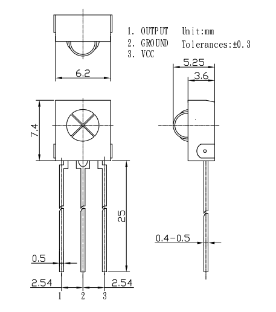

# 赤外線リモコン

## 受信
### 赤外線リモコン受信モジュールOSRB38C9AA

突起がついている方を正面として左から、OUTPUT、GROUND、VCC ($V_{CC}$ であり、CCとは Collector の略、回路が動作するために必要な電圧が入力される) のピンがついている。

- https://akizukidenshi.com/catalog/g/gI-04659/
- https://akizukidenshi.com/download/OSRB38C9AA.pdf



## LIRC（Linux Infrared Remote Control）

Linuxで赤外線信号を送受信するためのOSS.


## MOSFET（2N7000）


## GPIO

General perpose Input/Output


||型番|備考|
|:--:|:--:|:--:|
|トランジスタ|2SC1815S||
|MOSFET|IRFU9024NPBF||
|MOSFET|2N7000||


# LED

- 電流特性
- インピーダンス
- リアクタンス

- https://www.marutsu.co.jp/pc/static/large_order/led


## LED ドライバ

LEDは温度や電圧により明るさが変わるため、一定の電流が流れるように調整することが必要。並列接続などの場合は電流が均等にならない可能性もあるので、電流の制御を
LEDドライバで行う


# トランジスタ

トランジスタ
バイポータトランジスタ
電界効果トランジスタ
絶縁ゲート電界効果トランジスタ
接合型電解効果トランジスタ
絶縁ゲートバイポーラトランジスタ

トランジスタは信号を増幅させたり、ON/OFFのスイッチをする部品。


# MOSFET（Metal Oxide Semiconductor Field Effect Transistor）

- Drain
- Gate
- Source

G-S間に電圧を印加すると、D-S感が導通状態になるスイッチ素子。


# Nチャネル、Pチャネル

- Nチャネル（N-Ch）はSに対してプラスの電圧をGに印加すると導通状態（ON）になる
- Pチャネル（P-Ch）はSに対してマイナスの電圧をGに印加すると導通状態（ON）になる


## 絶対最大定格

絶対に超えては行けないという制限で、条件の指定がない場合は25℃のときの値。


||型番|備考|
|:--:|:--:|:--:|
|$V_{DSS}$||耐圧|
|$I_{DSS}$||直流で表した定格電流|
|$P_T$||許容損失|
|$V_{GSS}$||ゲートの保証電圧|
|$T_{ch}$||チップの保証温度|


# Arduino の設定

## IRremote

赤外線ユニットを使用するためのライブラリ。`lib` ディレクトリに入って、
`git clone` の実施。

```
ktakeda@jetson:~/workspace/led$ cd lib/
ktakeda@jetson:~/workspace/led/lib$ git clone git@github.com:Arduino-IRremote/Arduino-IRremote.git
```

その後、`pio run` でビルドすると使用できるようになる。


# 送受信モジュール

## 受光モジュールの設定

- ボードと受光モジュールを接続し、シリアル出力
  - しかしリモコンのON/OFFに関係なく `91C3D7D1` という出力が永遠にでる
  - `receiver.resume();` を忘れていたため、一度受光するとずっと出続けていたのだった
- リモコンの種類に応じて、16進数の値を出力することができた！
  - 今の所ノイズは乗っていないようだ


## 送信モジュール