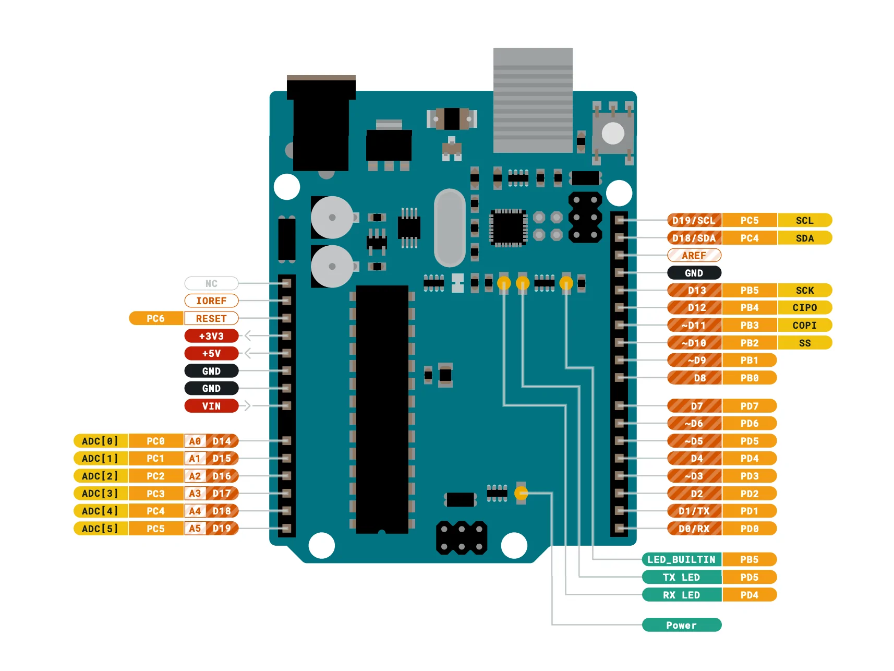

# PlatformIO

Arduinoを CUIから操作するためのライブラリ。

## Install 

```shell
sudo apt install arduino
sudo apt install python3-pip # platformioはpython3.6以上が必要
sudo pip3 install platformio
```

以上で platformio の設定が終わるはずで、platformio のコマンドは無いのだが（なぜ？）、pio という相当するコマンドはインストールされている。

```shell
which pio
/usr/local/bin/pio
```
init を打つと、src, lib, include ディレクトリが自動で生成される。また、platformio.ini ファイルも生成され、 このファイルはプロジェクトの設定ファイルである。

## build 

```
pio run
```


# Arduino

## setup()

Arduinoボードの電源を入れたとき、リセットしたときに一度だけ実行される。変数、ピンの初期化、ライブラリの宣言などに使用する。


# ボード PIN 





## Analog IN （A0~A5）

アナログ値の電圧を受け取ることができる入力PIN。


## Degital

### PWM（Pulse Width Modulation）

矩形パルスの幅を変調することができるPINで、これを使用することでLEDの明るさを連続的に変えたりすることができる。PIN番号の戦闘に「〜」がついているPINがPWMに対応している（PIN3,5,6,9,10,11）。
